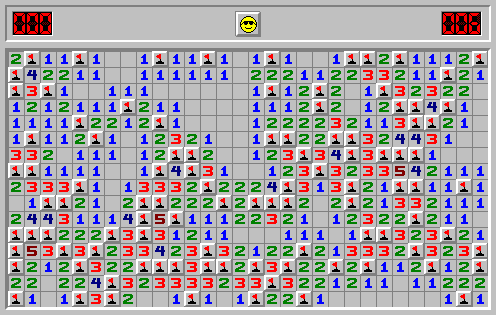
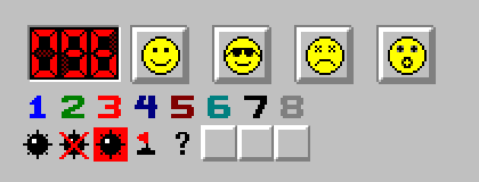

# minesweeper

Minesweeper game built with [React](https://github.com/facebook/react), [little-saga](https://github.com/little-saga/little-saga) and [@little-saga/use-saga](https://github.com/little-saga/use-saga)

Follow the links and start playing the game:

- [Normal Mode](http://shinima.pw/minesweeper/)
- [Hint Mode](http://shinima.pw/minesweeper/?hint)
- [Auto Mode](http://shinima.pw/minesweeper/?auto)

As you can see, you could configure the game via URL parameter. Enjoy playing~

## Introduction

> Minesweeper is a single-player puzzle video game. The objective of the game is to clear a rectangular board containing hidden "mines" or bombs without detonating any of them, with help from clues about the number of neighboring mines in each field.

The user interface of this game is quite straightforward: there are 480 (30 \* 16, advanced level default) tiles and each tile is either covered or revealed. Every covered tile may or may not have a mine under it. Every revealed tile shows the number of neighboring mines. Our task is to clear/open all the tiles while avoiding mines.

Data structure of the game state is not hard to design and implement. But when we play the game, the game state changes a lot and the UI changes a lot. Manipulating data is easy while synchronizing the UI according to the state by hand is really hard. In such cases, React turns out be a great view library which can synchronize the UI automatically for us.

## Framework

This project uses [React](https://facebook.github.io/react/) to draw the UI, [Immutable.js](https://facebook.github.io/immutable-js/) as the data structure utilities, [little-saga](https://github.com/little-saga/little-saga) and [@little-saga/use-saga](https://github.com/little-saga/use-saga) to implement the state management and game logic. Other used packages can be viewed in _package.json_. If you are familiar with these packages, then it is easy to figure out how the game runs.

## Data

### Data structure design

By default, the game contains 480(30\*16) tiles. We use array `mines` of length 480 to store whether there is a mine under tile. Tile at row `row` and col `col` corresponds to array index `row * 30 + col`, and...

- `-1` in the array means there is a mine.
- A non-negative number `x` means there is no mine under the tile and there are `x` neighboring mines.

We use another array `modes` to store the mode of each tile. Each tile has one of the following modes:

- `COVERED` means it is covered now. (Initial mode).
- `REVEALED` means it is revealed now. (After player clicks the tile or open propagation).
- `FLAG` means that player right-clicks the tile and marks there's a mine under the tile.
- `QUESTIONED` means that player right-clicks the tile twice and marks there may be a mine under the tile.
- `CROSS` means that player mark the wrong flags when game fails.
- `EXPLODED` means that this tile with a mine leads to game fail.

And `status` keeps the game state/status. Game status is one of the following 4 choices: _IDLE_, _ON_, _WIN_, _LOSE_

In _IDLE_ status, all tiles are covered and the timer is stopped, and when player click one tile timer will start and status will become _ON_. In _ON_ status, there are some tiles revealed and timer is counting which means the game is running. Once player clears all tiles or detonates a mine, then status becomes _WIN_ or _LOSE_.

`timer` keeps the number of seconds since game start.

`indicators` is used for AI auto playing the game. See the code for detail.

### Using the data structure to render the tiles

`status`, `mines`, `modes` and `timer`, the four variables together are sufficient to describe the total game state.

The render loginc of the 480 tiles are defined in `App#renderElements` in _app/App.js_. For each tile at `row`-th row `col`-th column that corresponds to array index `i = row * 30 + col`, we examine `modes[i]` and `mines[i]` to determine what should be rendered as follows:

1. If `modes[i]` is `REVEALED`, then a `<Mine />` or `<Number number={x} />` should be rendered according to `mines[i]`;
2. If `modes[i]` is `FLAG` or `QUESTIONED`, then a `<Flag />` or `<QuestionMark />`is renderd;
3. If `modes[i]` is `CROSS` OR `EXPLODED`, then a `<Mine />` with properties corss/exploded set should be renderd;
4. Else `modes[i]` is `COVERED`, render nothing.

### Data structure and interactions

`status` indicates global game state and influences the player interactions. Only in `IDLE`/`ON` status should game handle click actions. On `WIN`/`LOSE` status it is supposed that player must click the face to restart the game.

Besides left-click, we needs to handle middle-click (reveal neighboring tiles) and right-click (toggle among `COVERD`, `FLAG`, `QUESTIONED`). The game supports mouse movement with left-button or middle-button pressed, so wee need to track the mouse state. Because mouse state is not related with global game state, we puts the mouse state in `App#state`.

In `App#state`, field `btn1`/`btn2` records whether left-button/middle-button is pressed now. Field `point` records the array index of the tile under the mouse. We add event listeners at svg element to manipulate these fields. The event listeners are `App#onContextMenu`, `App#onMouseDown`, `App#onMouseMove` and `App#onMouseUp`.

In `onMouseDown`, if the game is not running, then the mouse down event is ignored, which is equivalent to disabling interactions. We do not add `onClick` event listener. The click actions are dispatched in `onMouseUp` after checking the mouse state. Is this way we implements mouse interactions that allow click behavior and allow mouse movement when the button is pressed.

The mouse interactions will be translated to three kinds of redux actions: `LEFT_CLICK`, `MIDDLE_CLICK` and `RIGHT_CLICK`. The action describes which button is clicked and the corresponding tile array index. There three kinds of actions are processed by saga in _app/sagas.js_ which will translate them into more detailed actions like `REVEAL` or `GAME_ON` for reducers.

Detailed logic could be viewed in _app/App.js_ and _app/sagas.js_.

## Sagas and reducers

The game main loop is managed by sagas and reducers. The root saga in _app/sagas.js_ starts several other sagas.

Saga `handleXxxClick` handles click actions and translate them into more detailed actions which will be processed by reducers.

Saga `timerHandler` watches for `GAME_OVER_WIN` / `GAME_OVER_LOSE` / `RESTART` actions and then reset timer. This saga also forks a `tickEmitter` to emit a tick action every second when the game status is `ON`.

Saga `watchReveal` watches for reveal actions. If player clears all tiles then this saga dispatch a `GAME_OVER_WIN` action; If player detonates a mine then this saga dispatch `GAME_OVER_LOSE`.

Saga `handleLeftClick` handles `LEFT_CLICK` actions. A `LEFT_CLICK` action describes that player click one tile and wants to reveal it. If we generates mines before player's first click , then the first click may encounter a mine and it is frustrating. So we generates mines after the first click and ensure first click can make a open propagation. When handling click actions in `IDLE` status, the left click must be the first left click; In `ON` status, it is not the first click.

Since in `IDLE` status mines have not been generated, `defaultMines` is used (in _app/common.js_). Function `generateMines` (in _app/common_) uses reservoir sampling algothrim and could generate random mines.

Saga `handleMiddleClick` handles `MIDDLE_CLICK` actions. It first checks the number at the tile (the tile is revealed, so it has a number) is equal to the number of neighboring flags. If the two numbers are equals, it means that neighboring covered tiles are supported to be safe, so it will reveal all the safe tiles at once.

Saga `handleRightClick` handles `RIGHT_CLICK` actions and dispatch `CHANGE_MODE` actions.

Most logic is implemented in sagas. Reducers are rather straightforward so it is not covered here.

## Components

Components are listed in the above image. The first line contains an `<LED />`, four `<Face />` with different facial expressions. The `<LED />` contains three `<SevenSegmentDisplay />` and a border. The second line contains several `<Number />`. The third line contains `<Mine />`, `<Flag />`, `<QuestionMark />` and `<Cover />`.
